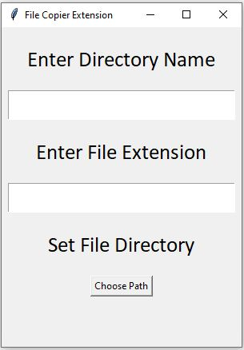

# FileExtensionCleaner

This is a python based desktop application which creates a seprate directory by copying all the specified extension file into that directory

Technlogy Used
- Python
- Tkinter

## Features of the Application
- Creates Seprate Directory for the Specified Extension File 

### Project Screenshot

